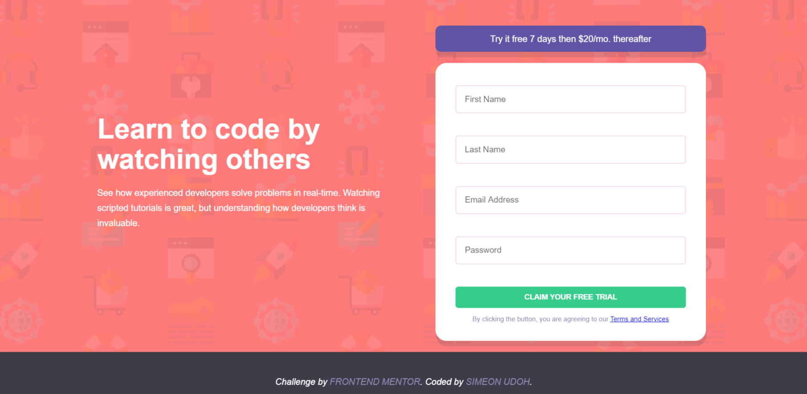

## 
Welcome! 👋

# Frontend Mentor - Intro component with sign up form Challenge

[Frontend Mentor](https://www.frontendmentor.io) challenges allow upcoming to improve your skills in a real-life workflow.

## The Challenge

The challenge was to build out this introductory component and get it looking as close to the design as possible.

## Tools used: 
* HTML5
* CSS3
* SASS
* NPM
* BEM METHODOLOGY 

**Link to published page:** https://simeon4real.github.io/Frontendmentor-challenge/

